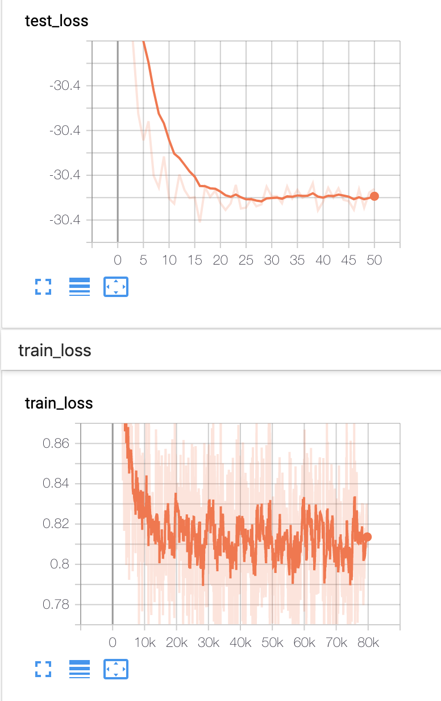

## LISTA
This repository is using Pytorch for reproducing the LISTA, TiLISTA and LISTA_CP.

### Data generation
see prob.py. We generate 
the matrix A: M(250) * N(500) We sample the
entries of A i.i.d. from the standard Gaussian distribution, Aij ∼ N (0, 1/M) and then normalize its
columns to have the unit l_2 norm. 

measure y: y = A * x

basis x: We decide each of its entry to be non-zero following the Bernoulli distribution with p_b = 0.1.
The values of the non-zero entries are sampled from the standard Gaussian distribution

We generate 10000 data for training and 1000 for testing.

### Model
16 layers of neural networks, W and S(not shared for each layer) as well as theta are learned.

### Training

loss: the output of each layer x_h. \Sum_h (x_h - x)^2
optimizer: Adam

lr: 5e-4

训练问题: loss, lr, training sample
Learning FISTA

a

